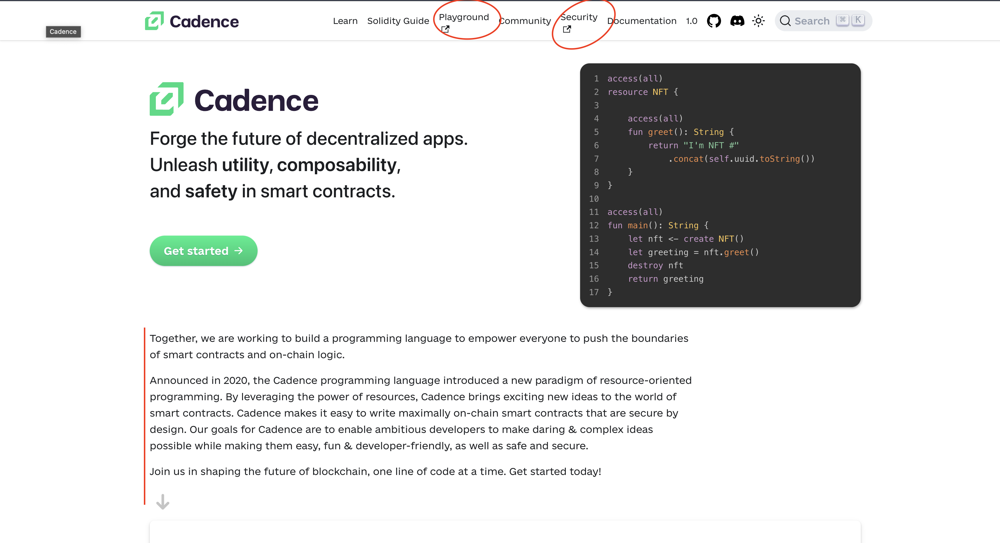
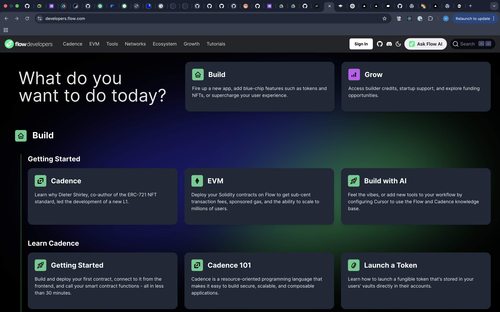

# Documentation Feedback

## Cadence lange doc

The Cadence documentation would greatly benefit from an interactive playground, which should be a core feature for any modern smart contract language. Key recommendations:

1. Add an interactive playground similar to TypeScript's playground at typescriptlang.org
2. Include side-by-side comparisons between Cadence, Solidity and Move to highlight Cadence's advantages
3. Maintain a detailed changelog to track language evolution and improvements
4. Improve overall documentation UI/UX quality and polish

## Developer Doc

The current documentation layout has several usability issues:

1. Card-based navigation takes up too much screen space
2. Information hierarchy is unclear, making it difficult for new users to know where to start
3. Consider adopting a more streamlined documentation structure similar to Stripe's docs (https://docs.stripe.com)

### Specific Recommendations

- Implement a cleaner, more compact navigation system
- Create clear "Getting Started" paths for different user types
- Improve information density while maintaining readability
- Add better visual hierarchy to guide users through documentation